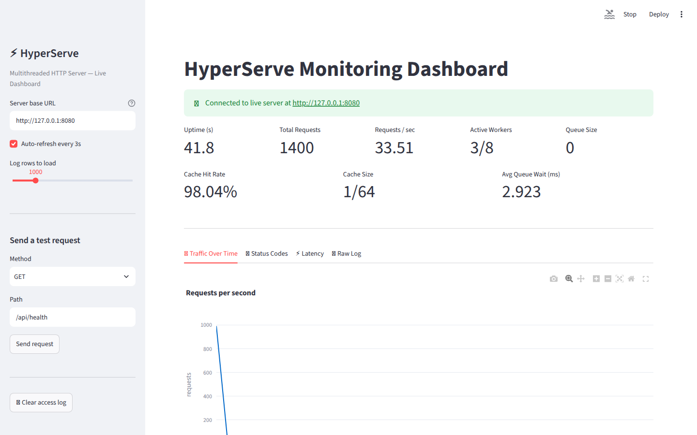
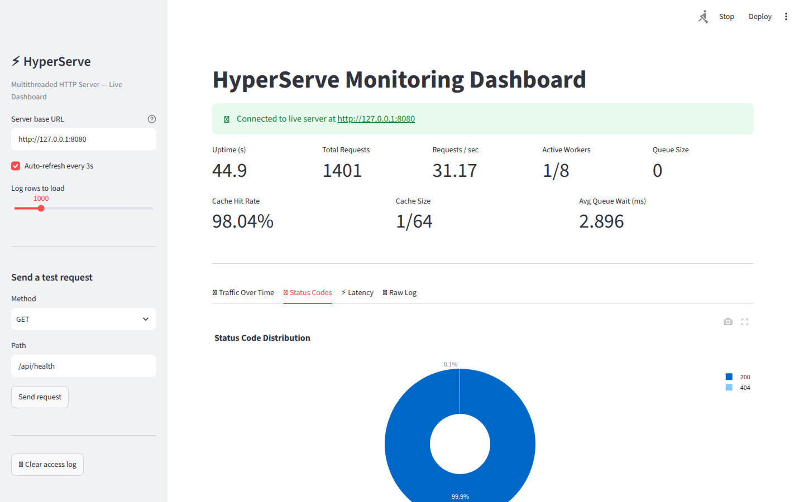
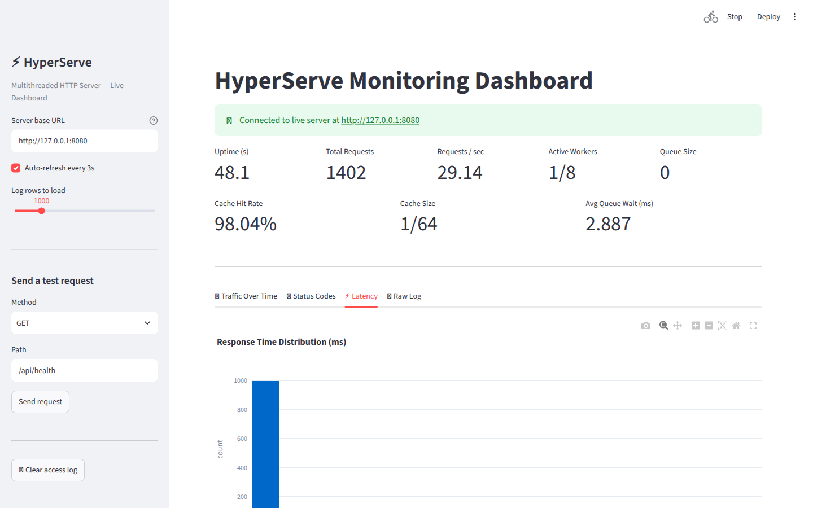
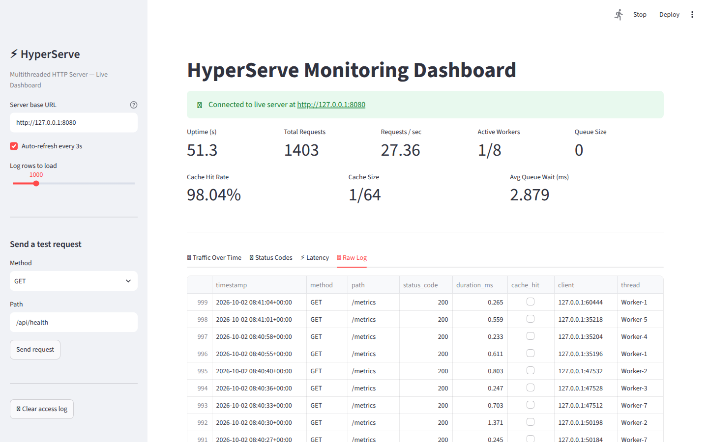
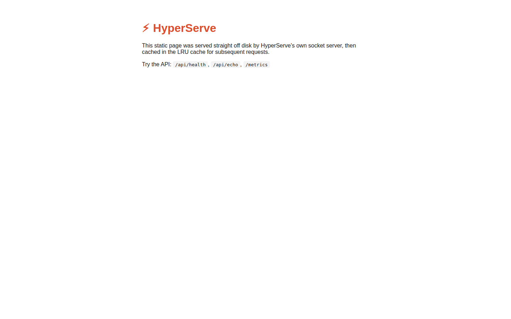

# ⚡ HyperServe

### A multithreaded HTTP/1.1 server built from raw TCP sockets in pure Python — no Flask, no FastAPI, no Django.

<p align="center">
  
  
  
  
  
  
</p>

<p align="center">
  <b>TCP Socket → Thread Pool → HTTP Parser → Middleware Chain → Router → Handler → LRU Cache → Response → JSON Log → Dashboard</b>
</p>

<p align="center">
  <a href="https://hyperserver-fqwkgztqp2yp6bm2fwkwbl.streamlit.app/"></a>
</p>

<p align="center">
  <a href="https://hyperserver-fqwkgztqp2yp6bm2fwkwbl.streamlit.app/"><b>Live Demo</b></a> ·
  <a href="https://github.com/N230881/HyperServer">GitHub Repository</a>
</p>

---

## 🚀 Live Demo

**Try the monitoring dashboard here:** 👉 **[https://hyperserver-fqwkgztqp2yp6bm2fwkwbl.streamlit.app/](https://hyperserver-fqwkgztqp2yp6bm2fwkwbl.streamlit.app/)**

The hosted dashboard runs on Streamlit Community Cloud. It can't reach a HyperServe instance on your laptop, so it runs in **Demo mode** and shows a real sample access log captured from the server. To see live metrics, run the server and the dashboard locally (see **Step-by-Step Setup** below).

---

## 🎬 Demo Video

*HyperServe serving the static page and the JSON API, then the Streamlit dashboard updating live under traffic: throughput, status codes, latency and the raw request log.*


https://github.com/user-attachments/assets/a48a3851-3442-4be8-a7e7-89ff2d23035e


---

## 📸 Monitoring Dashboard

HyperServe ships with a **Streamlit monitoring dashboard** that reads the server's `/metrics` endpoint and its structured access log in real time.

### 🖥️ Live Overview — uptime, throughput, workers, queue, cache



### 📈 Traffic Over Time


### 📊 Status Code Distribution



### ⚡ Latency



### 📋 Raw Request Log



### 🌐 Static Page Served by HyperServe



---

## 🌐 Quick Links

| Resource                 | Link                                                                         |
| ------------------------ | ---------------------------------------------------------------------------- |
| 🚀 **Live Demo**         | [Streamlit App](https://hyperserver-fqwkgztqp2yp6bm2fwkwbl.streamlit.app/) |
| 💻 **Source Code**       | [GitHub Repository](https://github.com/N230881/HyperServer)                  |

---

# 🚀 What is HyperServe?

**HyperServe** is a production-inspired HTTP server written **from scratch on top of Python's `socket` module**. It does not use `http.server`, Flask, FastAPI, Django or any other web framework — every byte of every request is read, parsed, routed and answered by code in this repository.

The **server itself has zero third-party dependencies** (standard library only: `socket`, `threading`, `queue`, `collections`, `json`, …). Third-party packages are used only by the optional dashboard.

Everything runs **100% locally**: no paid APIs, no external services and no signup.

Instead of a toy single-threaded loop, HyperServe implements the full request lifecycle of a real server:

```text
                   ┌────────────────────┐
                   │    HTTP Client     │
                   │ browser/curl/bench │
                   └─────────┬──────────┘
                             │  TCP
                             ▼
                   ┌────────────────────┐
                   │   SOCKET SERVER    │
                   │  accept() loop     │
                   └─────────┬──────────┘
                             │  (conn, addr)
                             ▼
                   ┌────────────────────┐
                   │    THREAD POOL     │
                   │ Queue + N workers  │
                   └─────────┬──────────┘
                             │
                             ▼
                   ┌────────────────────┐
                   │    HTTP PARSER     │
                   │ bytes → HTTPRequest│
                   └─────────┬──────────┘
                             │
                             ▼
                   ┌────────────────────┐
                   │  MIDDLEWARE CHAIN  │
                   │ timing / security /│
                   │   rate limiting    │
                   └─────────┬──────────┘
                             │
                             ▼
                   ┌────────────────────┐
                   │      ROUTER        │
                   │ HashMap + <params> │
                   └─────────┬──────────┘
                             │
                             ▼
                   ┌────────────────────┐
                   │  ROUTE HANDLER     │
                   │ JSON / HTML / file │◄──── LRU Cache
                   └─────────┬──────────┘
                             │
                             ▼
                   ┌────────────────────┐
                   │  RESPONSE BUILDER  │
                   │ raw HTTP/1.1 bytes │
                   └─────────┬──────────┘
                             │
                             ▼
                   ┌────────────────────┐
                   │  STRUCTURED LOGGER │
                   │ logs/*.jsonl       │──── Streamlit Dashboard
                   └────────────────────┘
```

Each stage is a separate module, so the server's internals stay **readable, testable and measurable**.

---

# 🧩 Architecture

| Module                        | Responsibility                                                     |
| ----------------------------- | ------------------------------------------------------------------ |
| `server/socket_server.py`     | Raw TCP listener, request framing, keep-alive, connection lifecycle |
| `server/thread_pool.py`       | Hand-rolled thread pool (shared `Queue` + fixed worker threads)    |
| `server/http_parser.py`       | Parses raw bytes into an `HTTPRequest` object                      |
| `server/router.py`            | HashMap routing, dynamic `<params>`, middleware chain              |
| `server/middleware.py`        | Timing, security headers, sliding-window rate limiter              |
| `server/response.py`          | Builds raw HTTP/1.1 responses + default security headers           |
| `server/lru_cache.py`         | Thread-safe LRU cache with hit/miss statistics                     |
| `server/logger.py`            | Structured JSON-lines access logging                               |
| `app/routes.py`               | Application layer: API, CRUD, static files, `/metrics`             |
| `main.py`                     | CLI entry point — wires router, middleware and server              |
| `benchmark.py`                | Load tester: throughput, latency percentiles, cache cold vs warm   |
| `dashboard/streamlit_app.py`  | Live monitoring dashboard (with demo-data fallback)                |
| `tests/test_server.py`        | Unit tests for the parser, LRU cache and router                    |

The project is split into a **framework layer** (`server/`) and an **application layer** (`app/`) — the same separation used by real backend frameworks.

---

# 🔬 Request Lifecycle

## 01 — Socket Server

`HyperServeServer` opens a TCP socket (`SO_REUSEADDR`, backlog `128`) and runs an `accept()` loop on the main thread. Every accepted connection is handed to the thread pool — the main thread never processes requests itself.

For each connection a worker:

* Reads until the end of headers (`\r\n\r\n`), then reads exactly `Content-Length` body bytes — so requests split across multiple TCP packets are handled correctly
* Enforces a **5 MB request cap** and a **5 s socket timeout**
* Ignores idle/speculative connections that browsers pre-open (no bogus log entries)
* Supports **persistent connections**: HTTP/1.1 is keep-alive by default unless `Connection: close`; HTTP/1.0 only when `Connection: keep-alive` is sent
* Serves at most **100 requests per connection** so a single client can't monopolise a worker

---

## 02 — Thread Pool

A classic **producer / consumer** design, written by hand (no `concurrent.futures`):

```text
   accept() loop  ──put──►  ┌────────────────────────┐  ──get──►  Worker-0
   (producer)               │  queue.Queue           │  ──get──►  Worker-1
                            │  (conn, addr, t_enq)   │  ──get──►  ...
                            └────────────────────────┘  ──get──►  Worker-N
```

The pool tracks, under a lock:

```text
num_threads
active_workers
queue_size
total_jobs_processed
avg_wait_time_ms      (time a connection waited in the queue)
```

A worker that hits an exception logs it and keeps running — workers never die silently.

---

## 03 — HTTP Parsing

`parse_request()` turns raw socket bytes into an `HTTPRequest`:

```text
GET /api/echo?name=you HTTP/1.1
Host: 127.0.0.1:8080
```

becomes:

```text
method       = "GET"
path         = "/api/echo"
query        = {"name": "you"}
http_version = "HTTP/1.1"
headers      = {"host": "127.0.0.1:8080"}   # lower-cased keys
body         = b""
```

`request.json()` decodes JSON bodies. Malformed input (empty request, bad request line) raises `HTTPParseError`, which the server turns into a `400 Bad Request`.

---

## 04 — Middleware Chain

Every middleware has the same signature:

```python
def middleware(request, next_fn) -> HTTPResponse
```

Middlewares wrap each other in registration order (onion model):

```text
timing ─► security_headers ─► rate_limiter ─► route handler
   ◄──────────────◄────────────────◄──────────────┘
```

| Middleware                     | Behaviour                                                         |
| ------------------------------ | ----------------------------------------------------------------- |
| `timing_middleware`            | Measures handler time                                             |
| `security_headers_middleware`  | Adds `X-Powered-By` and `Cache-Control` (`public, max-age=30` for GET, `no-store` otherwise) |
| `RateLimiter.middleware`       | Sliding-window limiter (deque of timestamps per client) → `429 Too Many Requests` |

A middleware can short-circuit the chain by returning its own response (that's how the rate limiter works).

---

## 05 — Routing

Routes are registered with decorators:

```python
@router.get("/api/items/<item_id>")
def get_item(request, item_id):
    ...
```

Internally:

```text
static_routes  = { "GET": { "/api/health": handler, ... } }     → O(1) dict lookup
dynamic_routes = { "GET": [ (["api","items","<item_id>"], handler) ] }  → segment matching
```

Static routes are tried first; dynamic routes fall back to a segment-by-segment match that extracts parameters as keyword arguments. Unknown routes return `404`; handler exceptions are converted to `400` / `500` JSON errors instead of crashing the worker.

---

## 06 — LRU Cache

Static files are cached in a **thread-safe LRU cache** built on `OrderedDict`:

```text
get(key)  → move_to_end(key)          (mark as most-recently used)
put(k, v) → insert; if over capacity → popitem(last=False)   (evict LRU)
```

The first request for a file reads it from disk; later requests are served from memory and logged with `cache_hit: true`. Hits, misses, size and hit rate are exposed via `/metrics`. Static file names are passed through `os.path.basename()` to prevent path traversal.

---

## 07 — Responses & Security Headers

`HTTPResponse.to_bytes()` builds the raw HTTP/1.1 response — status line, headers, `Content-Length`, `Date` and body. Every response includes:

```text
X-Content-Type-Options: nosniff
X-Frame-Options: DENY
X-XSS-Protection: 1; mode=block
Referrer-Policy: strict-origin-when-cross-origin
Server: HyperServe/1.0
```

Helpers: `text_response`, `html_response`, `json_response`, `file_response`, `error_response`.

---

## 08 — Structured Logging

Every request is appended as **one JSON object per line** to `logs/access_log.jsonl` (thread-safe writes) and echoed to the console:

```json
{"timestamp": "2026-09-20T13:17:47.349425Z", "epoch": 1789910267.349, "method": "GET",
 "path": "/", "status_code": 200, "duration_ms": 0.081, "client": "127.0.0.1:56998",
 "cache_hit": true, "thread": "Worker-2"}
```

This log is what the dashboard charts.

---

# 🌐 API Endpoints

| Method   | Path                    | Description                                              |
| -------- | ----------------------- | -------------------------------------------------------- |
| `GET`    | `/`                     | Static HTML home page (LRU cached)                       |
| `GET`    | `/static/<filename>`    | Any file in `app/static/` (LRU cached)                   |
| `GET`    | `/api/health`           | Health check                                             |
| `GET`    | `/api/echo`             | Echoes method, path, query params and headers            |
| `POST`   | `/api/echo`             | Echoes the JSON (or raw) request body                    |
| `GET`    | `/api/items`            | List items (in-memory store)                             |
| `POST`   | `/api/items`            | Create an item — `{"name": "..."}` → `201 Created`       |
| `GET`    | `/api/items/<item_id>`  | Get one item (`404` if missing)                          |
| `DELETE` | `/api/items/<item_id>`  | Delete one item (`404` if missing)                       |
| `GET`    | `/metrics`              | Server, thread-pool and cache statistics                 |
| `POST`   | `/debug/clear-cache`    | Dev-only: clears the LRU cache (used by `benchmark.py`)  |

### Example `/metrics` response

```json
{
  "uptime_seconds": 12.3,
  "total_requests": 1394,
  "requests_per_sec": 113.09,
  "thread_pool": {
    "num_threads": 8,
    "active_workers": 2,
    "queue_size": 0,
    "total_jobs_processed": 313,
    "avg_wait_time_ms": 2.985
  },
  "cache": {
    "capacity": 64,
    "size": 1,
    "hits": 50,
    "misses": 1,
    "hit_rate_pct": 98.04,
    "keys": ["index.html"]
  }
}
```

---

# 📁 Repository Structure

```text
HyperServer/
│
├── server/                    # Framework layer
│   ├── __init__.py
│   ├── socket_server.py       # TCP listener + connection lifecycle + keep-alive
│   ├── thread_pool.py         # Queue + worker threads
│   ├── http_parser.py         # bytes -> HTTPRequest
│   ├── router.py              # HashMap routing + dynamic params + middleware chain
│   ├── middleware.py          # timing, security headers, rate limiter
│   ├── response.py            # raw HTTP/1.1 responses
│   ├── lru_cache.py           # thread-safe LRU cache
│   └── logger.py              # structured JSON-lines logging
│
├── app/                       # Application layer
│   ├── __init__.py
│   ├── routes.py              # API, CRUD, static files, /metrics
│   ├── static/
│   │   ├── index.html         # home page (served + cached)
│   │   └── style.css
│   └── pages/                 # HTML page templates
│       ├── _layout.html
│       ├── home.html
│       ├── about.html
│       └── items.html
│
├── dashboard/
│   ├── streamlit_app.py       # live monitoring dashboard
│   └── _demo_data.py          # embedded sample log for demo mode
│
├── tests/
│   └── test_server.py         # parser, LRU cache, router tests
│
├── docs/                      # README screenshots
│
├── logs/                      # access_log.jsonl is generated here (git-ignored)
│
├── main.py                    # entry point
├── benchmark.py               # load-testing tool
├── requirements.txt           # dashboard-only dependencies
└── README.md
```

---

# ⚙️ Step-by-Step Setup (on your laptop)

Everything runs **100% locally**: no paid APIs, no external services and no signup.

### Step 1 — Install Python

You need **Python 3.9+**. Check with:

```bash
python3 --version
```

If you don't have it, download it from [python.org/downloads](https://www.python.org/downloads/) (free, official source).

### Step 2 — Get the project onto your laptop

```bash
git clone https://github.com/N230881/HyperServer.git
cd HyperServer
```

(Or download the ZIP from GitHub, unzip it, and open a terminal inside the folder.)

### Step 3 — (Recommended) Create a virtual environment

This keeps HyperServe's dependencies isolated from the rest of your system.

```bash
python3 -m venv venv

# Activate it:
source venv/bin/activate        # macOS / Linux
venv\Scripts\activate           # Windows (PowerShell: venv\Scripts\Activate.ps1)
```

### Step 4 — Install dependencies

The **server itself needs zero third-party packages**. It uses only the standard library (`socket`, `threading`, `queue`, etc.). You only need to install anything if you want the dashboard:

```bash
pip install -r requirements.txt     # streamlit, pandas, plotly
```

### Step 5 — Run the server

```bash
python main.py --host 127.0.0.1 --port 8080 --threads 8
```

You should see:

```text
HyperServe listening on http://127.0.0.1:8080
Thread pool size: 8
```

Leave this terminal running.

#### CLI options

| Flag           | Default      | Description                                    |
| -------------- | ------------ | ---------------------------------------------- |
| `--host`       | `127.0.0.1`  | Interface to bind (`0.0.0.0` for all)          |
| `--port`       | `8080`       | Port to listen on                              |
| `--threads`    | `8`          | Number of worker threads in the pool           |
| `--rate-limit` | `0`          | Max requests per minute per client (`0` = off) |

### Step 6 — Try it in a browser or with curl

Open a **second terminal** and keep the server running in the first:

```bash
curl http://127.0.0.1:8080/api/health
curl "http://127.0.0.1:8080/api/echo?name=you"
curl -X POST http://127.0.0.1:8080/api/items -d '{"name":"widget"}'
curl http://127.0.0.1:8080/api/items/1
curl -X DELETE http://127.0.0.1:8080/api/items/1
curl http://127.0.0.1:8080/metrics
```

Example:

```bash
$ curl -i http://127.0.0.1:8080/api/items/1
```

```text
HTTP/1.1 200 OK
X-Content-Type-Options: nosniff
X-Frame-Options: DENY
X-XSS-Protection: 1; mode=block
Referrer-Policy: strict-origin-when-cross-origin
Server: HyperServe/1.0
Content-Type: application/json
X-Powered-By: HyperServe
Cache-Control: public, max-age=30
Connection: keep-alive
Content-Length: 33

{
  "id": 1,
  "name": "widget"
}
```

You can also open **http://127.0.0.1:8080/** in your browser. It serves the static HTML page, which the LRU cache keeps in memory after the first request.

### Step 7 — Run the Streamlit dashboard

In a **third terminal** (server still running in terminal 1):

```bash
source venv/bin/activate     # if you used a venv
streamlit run dashboard/streamlit_app.py
```

This opens a browser tab (usually `http://localhost:8501`) showing:

| View                   | Information                                                    |
| ---------------------- | -------------------------------------------------------------- |
| 🧮 Metric cards        | Uptime, total requests, req/s, active workers, queue size, cache hit rate, cache size, avg queue wait |
| 📈 Traffic Over Time   | Requests per second, top requested paths                       |
| 📊 Status Codes        | Status-code distribution, requests by HTTP method              |
| ⚡ Latency             | Response-time histogram, latency-over-time scatter, cache hits |
| 📋 Raw Log             | Sortable table of the most recent requests                     |
| 🧪 Sidebar             | **Fire test `GET` / `POST` requests** from the dashboard, clear the access log |

Make sure the **"Server base URL"** field in the sidebar matches the host and port you started the server with (default `http://127.0.0.1:8080`).

**Live vs Demo mode**

* **Live mode:** if a HyperServe instance is reachable at the *Server base URL*, the dashboard shows real data from `/metrics` and `logs/access_log.jsonl` and refreshes every 3 s.
* **Demo mode:** if no server is reachable, the dashboard switches to a real sample log embedded in `dashboard/_demo_data.py`. This happens, for example, when the dashboard is deployed on Streamlit Community Cloud while the server runs on your laptop.

### Step 8 — Run the unit tests

```bash
python -m unittest tests/test_server.py -v
```

| Suite              | Covers                                                          |
| ------------------ | --------------------------------------------------------------- |
| `TestHTTPParser`   | GET parsing + query params, POST JSON body, empty / malformed requests |
| `TestLRUCache`     | Put/get, LRU eviction order, hit/miss statistics                |
| `TestRouter`       | Static routes, dynamic `<params>`, unknown routes, middleware execution order |

### Step 9 — Run the benchmark

With the server running in terminal 1:

```bash
python benchmark.py --host 127.0.0.1 --port 8080 --path /api/health --requests 500 --concurrency 20
```

This prints requests/sec plus average, median, P95 and P99 latency, a cold-vs-warm cache comparison, and the server's own `/metrics`. You can use these numbers as the project's performance results. See the **Benchmarking** section below for all flags and a sample run.

---

# 🏎️ Benchmarking

With the server running:

```bash
python benchmark.py --host 127.0.0.1 --port 8080 --path /api/health --requests 2000 --concurrency 20
```

`benchmark.py` spawns `--concurrency` virtual clients, each reusing **one persistent keep-alive connection**, and reports throughput and latency percentiles. It then runs a **cold vs warm cache** comparison on a static path (clearing the cache before every cold sample via `/debug/clear-cache`) and prints the server's own `/metrics`.

| Flag              | Default        | Description                                  |
| ----------------- | -------------- | -------------------------------------------- |
| `--host`          | `127.0.0.1`    | Server host                                  |
| `--port`          | `8080`         | Server port                                  |
| `--path`          | `/api/health`  | Path for the throughput test                 |
| `--requests`      | `1000`         | Total requests                               |
| `--concurrency`   | `50`           | Concurrent clients                           |
| `--static-path`   | `/`            | Path for the cache cold-vs-warm comparison   |
| `--json-out`      | —              | Write full results to a JSON file            |

### Sample run

Local run, 8 worker threads, 2,000 requests, 20 concurrent clients (Python 3.10, Linux). Your numbers will vary by machine.

| Metric                         | Result          |
| ------------------------------ | --------------- |
| Requests / sec                 | **~6,800**      |
| Successful / errors            | 2,000 / 0       |
| Median latency                 | 1.07 ms         |
| P95 latency                    | 1.98 ms         |
| P99 latency                    | 4.17 ms         |
| Static page — cold cache (avg) | 0.156 ms        |
| Static page — warm cache (avg) | 0.096 ms        |
| Latency improvement from cache | **~38%**        |

---

# 🛠️ How to Use / Extend It

### Add a new route

Edit `app/routes.py`:

```python
@router.get("/api/hello/<name>")
def say_hello(request, name):
    return json_response({"message": f"Hello, {name}!"})
```

Restart the server. No other file needs to change.

### Add a new middleware

Edit `server/middleware.py`, or write your own function with the signature `def my_mw(request, next_fn): ...`:

```python
def request_id_middleware(request, next_fn):
    response = next_fn(request)
    response.headers["X-Request-Id"] = str(uuid.uuid4())
    return response
```

Then register it in `main.py`:

```python
router.use(request_id_middleware)
```

### Change thread pool size / port

```bash
python main.py --host 0.0.0.0 --port 9000 --threads 16 --rate-limit 200
```

`--rate-limit N` caps each client to N requests/minute (`0` disables it).

### Serve more static files

Drop files into `app/static/` and access them at `/static/<filename>`. The first request reads from disk; later requests are served from the in-memory LRU cache.

---

# 📐 Data Structures & Concepts

```text
✓ Raw TCP sockets (bind / listen / accept / recv / sendall)
✓ HTTP/1.1 request framing (headers + Content-Length body)
✓ Persistent keep-alive connections
✓ Producer / consumer thread pool (queue.Queue + worker threads)
✓ Locks for shared counters and log writes
✓ HashMap routing — O(1) static route lookup
✓ Dynamic path parameters via segment matching
✓ Onion-model middleware chain (higher-order functions)
✓ Sliding-window rate limiter (deque per client)
✓ LRU cache (OrderedDict, O(1) get / put / evict)
✓ Structured JSON-lines logging
✓ Load testing with latency percentiles (P95 / P99)
✓ Real-time observability dashboard
```

---

# 🧠 Design Principles

### Separation of Concerns
The framework (`server/`) knows nothing about the application (`app/`); routes are plain Python functions.

### Zero-Dependency Core
The server runs on the Python standard library alone.

### Fail Safely
Parse errors → `400`, missing routes → `404`, rate limiting → `429`, handler exceptions → `500` — a bad request never kills a worker thread.

### Observable by Default
Every request is timed, logged as structured JSON and visible in `/metrics` and the dashboard.

### Measurable
Performance claims come from a reproducible benchmark, not guesses.

---

# ⚠️ How This Differs from a Real Production Server

HyperServe is an **educational implementation**, not a replacement for NGINX, Apache, Gunicorn or Uvicorn. It doesn't do:

* Real TLS/HTTPS termination (it would need `ssl.SSLContext.wrap_socket()` and a certificate, which is a good next step)
* HTTP/2
* Chunked transfer encoding
* Full RFC-compliant HTTP parsing edge cases
* Persistent storage (the items API uses an in-memory dict)

HTTP/1.1 **keep-alive is supported**, with a limit of 100 requests per connection.

The rate limiter identifies clients by the `X-Client-IP` request header; requests without it share a single bucket.

These gaps make good "future work" talking points for interviews. For example, if asked *"How would you support HTTPS?"*, the answer is to wrap the raw socket with `ssl.SSLContext.wrap_socket()` before the accept loop.

---

# 🛣️ Roadmap

## Protocol

* [ ] HTTPS via `ssl.SSLContext.wrap_socket()`
* [ ] Chunked transfer encoding
* [ ] Gzip compression
* [ ] HTTP/2

## Server

* [ ] `asyncio` / `selectors` event-loop backend to compare against the thread pool
* [ ] Graceful shutdown that drains in-flight requests
* [ ] Configurable cache capacity and timeouts

## Application

* [ ] Route the HTML templates in `app/pages/` (`/about`, `/items`)
* [ ] Persistent storage (SQLite) for the items API
* [ ] Authentication middleware

## Tooling

* [ ] Integration tests against a running server
* [ ] CI workflow
* [ ] Docker image

---

# 🤝 Contributing

Contributions, bug reports and experiments are welcome.

```bash
git checkout -b feature/my-feature
python -m unittest tests/test_server.py -v
python main.py
python benchmark.py
```

Then commit your changes and open a pull request.

---

# 👨‍💻 Author

## Shaik Sumayya Ruhi

**B.Tech — Artificial Intelligence & Machine Learning**

GitHub: [https://github.com/N230881](https://github.com/N230881)

Project: [https://github.com/N230881/HyperServer](https://github.com/N230881/HyperServer)

---

<div align="center">

### ⭐ If you find this project useful, consider starring the repository.

**Built from raw sockets to understand how web servers actually work.**

`Socket → Thread Pool → Parser → Middleware → Router → Cache → Response → Logs`

</div>
